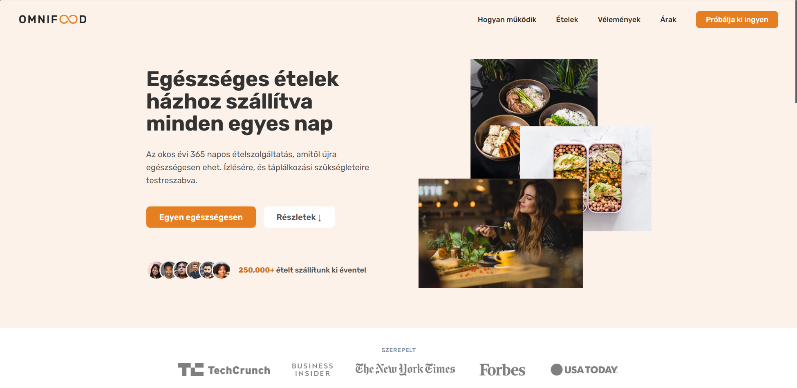
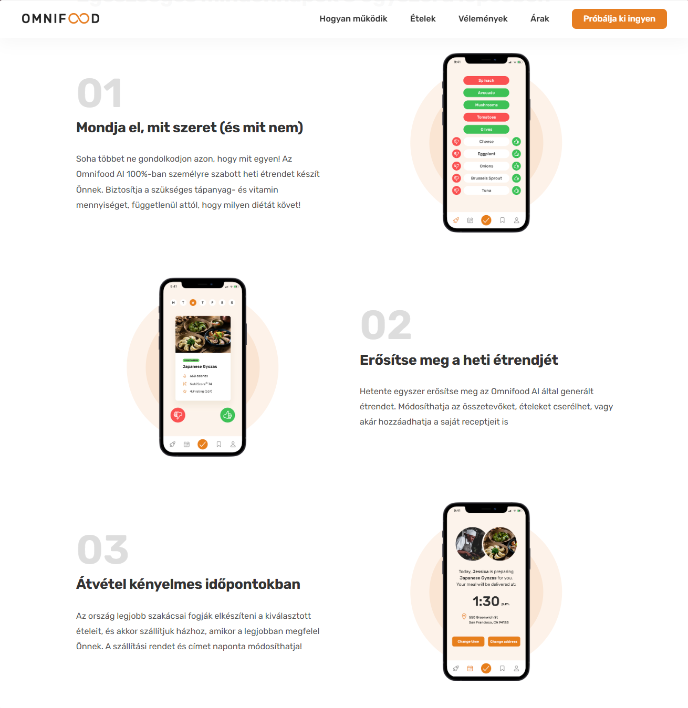
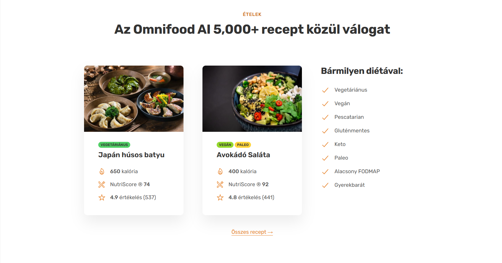
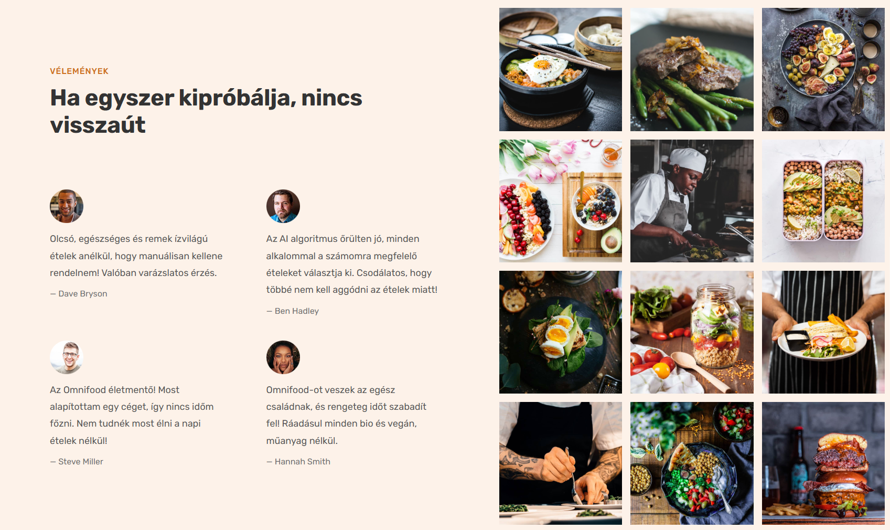
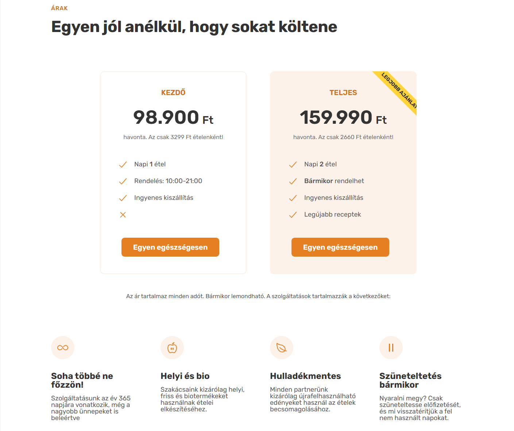
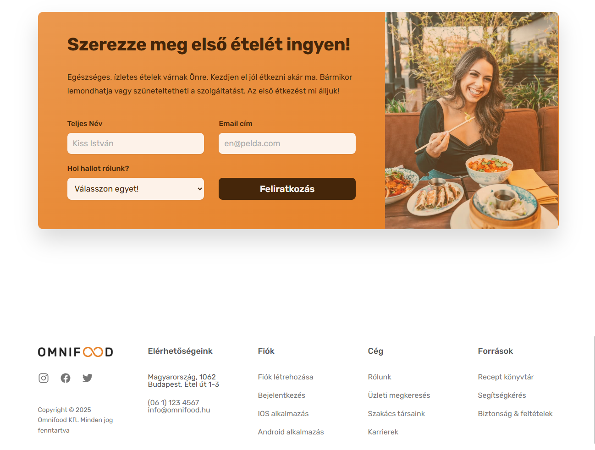

# Omnifood

This project was created as part of an **HTML, CSS and Webdesign** Udemy course in 2022.  
It was designed to improve frontend development skills by focusing on **responsive design**, **CSS flexbox/grid**, and **modern UI techniques**.

## 🚀 Features
- Fully responsive landing page
- Modern and clean design
- Practice of CSS Grid and Flexbox

## 📅 Project Details
- **Course**: Udemy - Learn modern HTML5, CSS3 and web design  
- **Year**: 2022  
- **Technologies**: HTML, CSS  

## 📸 Preview  

---

⭐ This was a learning project and is not actively maintained.
